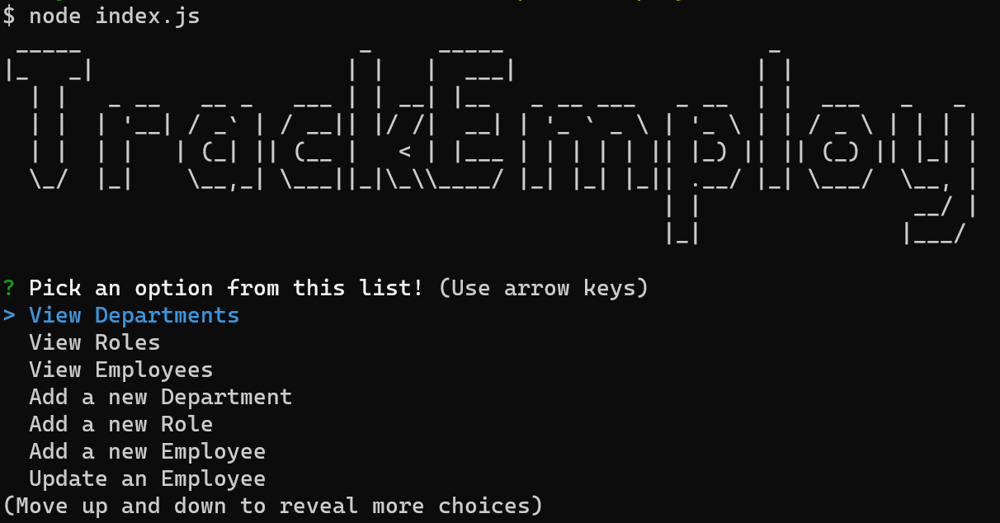

# TrackEmploy

## Description

TrackEmploy is a command line application for managing and updating your employee database.

## Installation

Run the npm i command from the trackemploy directory

```bash
npm i
```

## Usage

Run the command node index.js from the trackemploy directory

```bash
node index.js
```

Then choose one of the options from the list



Then follow the prompts that come after the associated option you chose! Choosing any of the "view" options will display a table of the associated data.